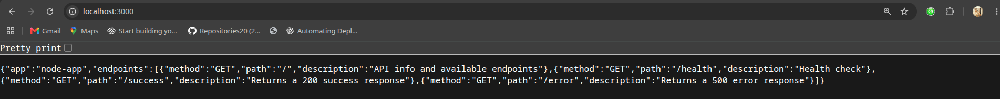
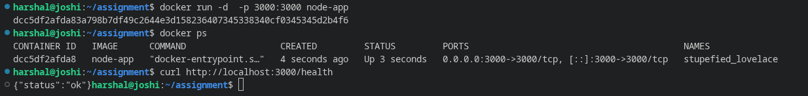
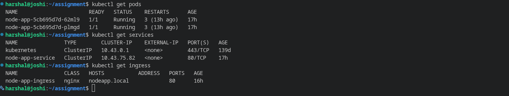
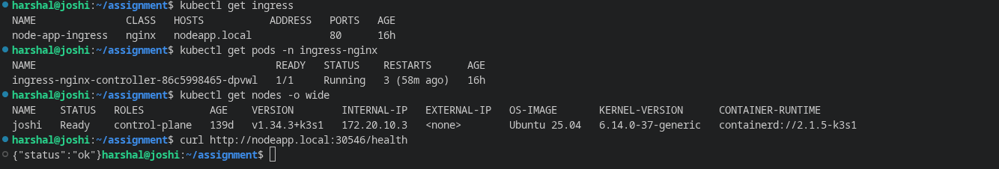
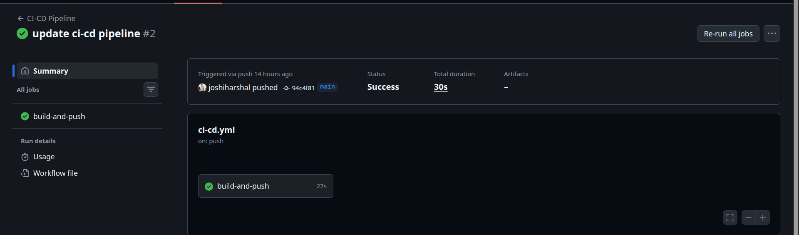
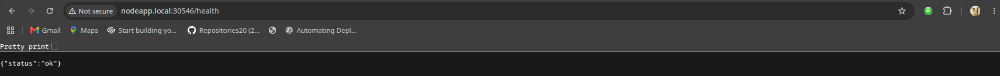

# Node.js App — DevOps Assignment

   

---

## Project Overview

A production-ready Node.js application fully containerized with Docker and deployed on a local **K3s** Kubernetes cluster. The application is exposed externally using the **NGINX Ingress Controller** with hostname-based routing. A complete **GitHub Actions** CI/CD pipeline automates the build, push, and deployment process.

---

## Architecture

```
  Client Browser / curl
         │
         │  http://nodeapp.local
         ▼
┌──────────────────────────────────────────────────┐
│                  K3s Cluster                     │
│                                                  │
│  ┌────────────────────────────────────────────┐  │
│  │          NGINX Ingress Controller          │  │
│  │    Listens on port 80, routes by host      │  │
│  └──────────────────┬─────────────────────────┘  │
│                     │                            │
│  ┌──────────────────▼─────────────────────────┐  │
│  │            ClusterIP Service               │  │
│  │          node-app-service                  │  │
│  │             port 80 → 3000                 │  │
│  └─────────────┬──────────────┬───────────────┘  │
│                │              │                  │
│  ┌─────────────▼────┐  ┌──────▼─────────────┐    │
│  │      Pod 1       │  │       Pod 2         │   │
│  │  node-app:3000   │  │   node-app:3000     │   │
│  └──────────────────┘  └────────────────────┘    │
└──────────────────────────────────────────────────┘

Request Flow:  Client → Ingress → Service → Pod
```

---

## Components Used

| Component | Tool |
|---|---|
| Application | Node.js 20 |
| Containerization | Docker (node:20-alpine) |
| Local Kubernetes | K3s |
| Ingress Controller | NGINX Ingress Controller |
| Container Registry | Docker Hub |
| CI/CD | GitHub Actions |

---

## Setup Instructions

### Prerequisites

- Docker installed and running
- K3s installed
- kubectl configured
- Node.js 20+

---

### Local Setup

```bash
git clone https://github.com/joshiharshal/devops-assignment.git
cd assignment/node-app
npm install
npm start
```

Open: `http://localhost:3000`

---

### Docker Setup

**Build the image:**
```bash
docker build -t node-app .
```

**Run the container:**
```bash
docker run -p 3000:3000 node-app
```

**Run in background:**
```bash
docker run -d -p 3000:3000 --name node-app node-app
```

**Verify:**
```bash
docker ps
curl http://localhost:3000
```

---

### Kubernetes Deployment Steps

**Apply all manifests:**
```bash
kubectl apply -f k8s/deployment.yaml
kubectl apply -f k8s/service.yaml
kubectl apply -f k8s/ingress.yaml
```

**Verify everything is running:**
```bash
kubectl get pods
kubectl get deployments
kubectl get services
kubectl get ingress
```

---

## Ingress Setup

### Ingress Controller Used

**NGINX Ingress Controller** — installed via official Kubernetes manifests.

> Note: K3s ships with Traefik by default. This project uses NGINX Ingress Controller instead.

### Install NGINX Ingress Controller

```bash
kubectl apply -f https://raw.githubusercontent.com/kubernetes/ingress-nginx/main/deploy/static/provider/cloud/deploy.yaml
```

**Verify controller is running:**
```bash
kubectl get pods -n ingress-nginx
```

### Apply Ingress Manifest

```bash
kubectl apply -f k8s/ingress.yaml
```

### Configure Local DNS

Get your K3s node IP:
```bash
kubectl get nodes -o wide
```

Add to `/etc/hosts`:
```
<K3s-NODE-IP>   nodeapp.local
```

### How Traffic Reaches the Application

```
1. User visits http://nodeapp.local
2. /etc/hosts resolves nodeapp.local → K3s Node IP
3. NGINX Ingress Controller receives the request on port 80
4. Ingress rule matches host: nodeapp.local → forwards to node-app-service
5. ClusterIP Service load balances across Pod 1 and Pod 2 on port 3000
6. Pod handles the request and sends response back
```

**Test:**
```bash
curl http://nodeapp.local
```

---

## CI/CD Workflow

### Pipeline Trigger

Runs automatically on every push to the `main` branch.

### Pipeline Stages

```
Push to main branch
        │
        ▼
┌───────────────────┐
│  1. Checkout code │
└────────┬──────────┘
         │
         ▼
┌───────────────────┐
│  2. Setup Node 20 │
└────────┬──────────┘
         │
         ▼
┌───────────────────┐
│  3. npm install   │
└────────┬──────────┘
         │
         ▼
┌───────────────────┐
│  4. Docker build  │
└────────┬──────────┘
         │
         ▼
┌──────────────────────────┐
│  5. Push to Docker Hub   │
└────────┬─────────────────┘
         │
         ▼
┌───────────────────┐
│  6. Update yaml   │
└────────┬──────────┘
         │
         ▼
┌───────────────────┐
│  7. Deploy   │
└───────────────────┘
```

### Required GitHub Secrets

Go to **Settings → Secrets and variables → Actions** and add:

| Secret | Value |
|---|---|
| `DOCKER_USERNAME` | Your Docker Hub username |
| `DOCKER_PASSWORD` | Your Docker Hub password or access token |

---

## Commands Reference

### Build

```bash
# Build Docker image
docker build -t node-app .

# Build and tag for Docker Hub
docker build -t harshal001/node-app:v1 .
```

### Run

```bash
# Run locally
npm start

# Run with Docker
docker run -p 3000:3000 node-app

# Run in background
docker run -d -p 3000:3000 --name node-app node-app
```

### Deploy

```bash
# Apply Kubernetes manifests
kubectl apply -f k8s/deployment.yaml
kubectl apply -f k8s/service.yaml
kubectl apply -f k8s/ingress.yaml

# Push image to Docker Hub
docker push harshal001/node-app:v1
```

### Debug

```bash
# Check pod status
kubectl get pods -o wide

# View pod logs
kubectl logs -l app=node-app

# Describe pod (see events and errors)
kubectl describe pod <pod-name>

# Get shell inside a pod
kubectl exec -it <pod-name> -- sh

# Port-forward to access without ingress
kubectl port-forward svc/node-app-service 8080:80
curl http://localhost:8080

# Check ingress
kubectl describe ingress node-app-ingress

# Check ingress controller logs
kubectl logs -n ingress-nginx -l app.kubernetes.io/component=controller

# Rollback deployment
kubectl rollout undo deployment/node-app

# Check rollout status
kubectl rollout status deployment/node-app
```

---

## Screenshots

### 1. Application Running Locally

<br>

### 2. Docker Container Running

<br>

### 3. Kubernetes Pods and Services

<br>

### 4. Ingress Working

<br>

### 5. CI/CD Pipeline Execution

<br>

### 6. Successful API Response

---

## Author

**Harshal** — DevOps Assignment Submission